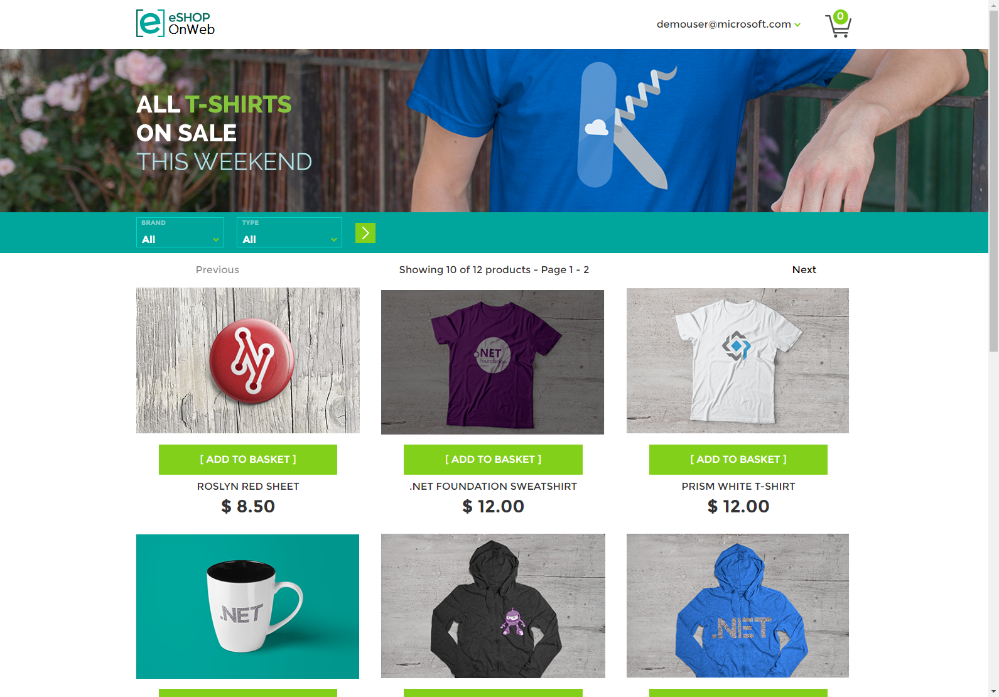

These are some of the features in eShopOnWeb:

- [Single sign-on with GitHub]({{ site.baseurl }}/features/sso-with-github)
- [Role Management]({{ site.baseurl }}/features/role-management)
- [User Management]({{ site.baseurl }}/features/user-management)
- [Role Membership]({{ site.baseurl }}/features/role-membership)

If you want to learn more about implementing these features, check out our course - [ASP.NET Identity in Action: Implementing Individual Accounts](https://academy.nimblepros.com/p/applying-identity-to-asp-net).