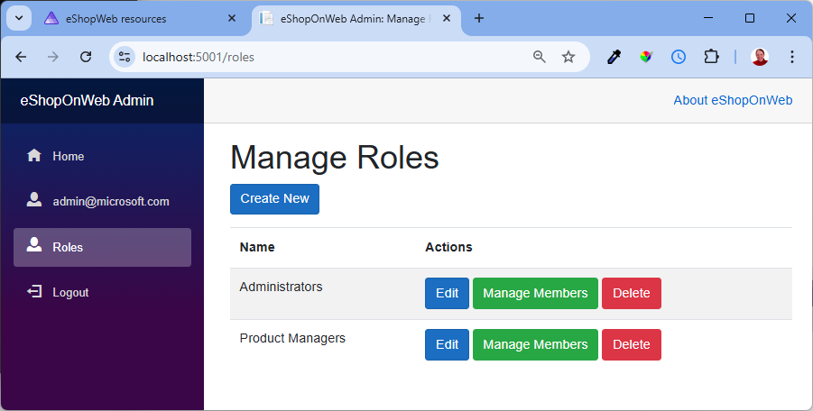

eShopOnWeb has a storefront and an admin portal. As like any other storefront, we don't want our users to be able to manage the products. We also don't want our system admins managing products. We have product managers to manage the products.

We also don't want our users nor the product managers to manage the roles and users in the system.

We have roles in place to manage these responsibilities.

## Starting Roles

The starting roles in eShopOnWeb include:

- Product Managers - for managing the products in the storefront
- Administrators - for managing the roles and users in the system

## Working with Roles

In the role management section, the administrators can:

- Add new roles
- Update role names
- Delete unassigned roles
- Remove users from a role
- View members of a role

If a role has members, we have logic in place to prevent that role from being deleted. If we didn't have the logic in place, RoleManager would do a cascade delete and remove the assignments as well as the role.
