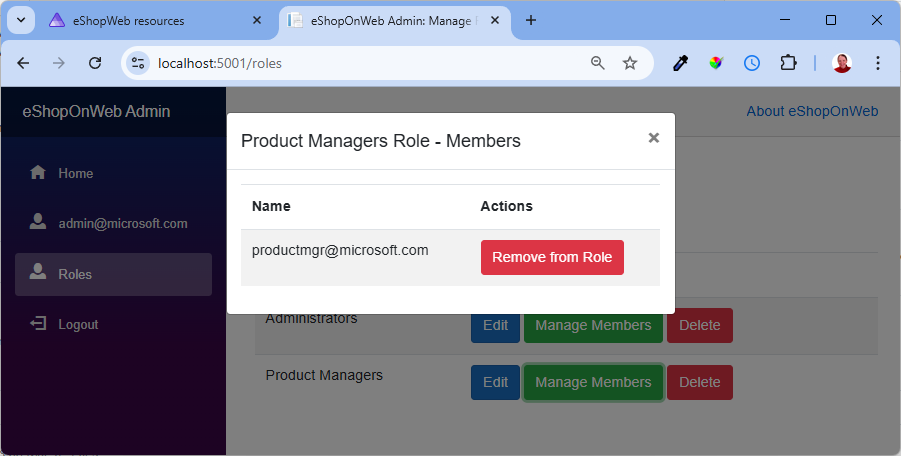

As mentioned in [Role Management]({{ site.baseurl }}/features/role-management), there are starting roles with the system. There are also starting role assignments.

## Starting Role Assignments

These are the starting accounts and their role assignments:

| Account Name | Password | Role |
|--------------|----------|------|
| demouser@microsoft.com | Pass@word1 | |
| productmgr@microsoft.com | Pass@word1 | Product Manager |
| admin@microsoft.com | Pass@word1 | Administrator |

## Managing Role Membership

The code is arranged with the following role membership management:

- A user can be added or removed from a role in [user management]({{ site.baseurl }}/features/user-management).
- A user can be removed from a role in [role management]({{ site.baseurl }}/features/role-management).
- A list of the role's members can be seen in [role management]({{ site.baseurl }}/features/role-management).

## Important Things to Note about Role Membership

These are some things to keep in mind:

- A user does not need to have a role assigned. The `demouser@microsoft.com` account can be authenticated and meets the `[Authorize]` check. However, they do not have any roles assigned.
- A user can have multiple role assignments.
- A role cannot be deleted unless it is unassigned. We have logic in place for this.