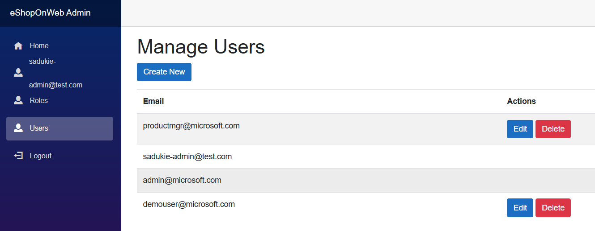

We have the ability to manage users in the eShopOnWeb admin portal. However, users themselves can manage their passwords and external logins. The User Management section was built with some administrative flags in mind - confirming emails, confirming phone numbers, and the ability to disable MFA if needed.

## Starting Users

The starting users include:

| Account Name | Password | Role |
|--------------|----------|------|
| demouser@microsoft.com | Pass@word1 | |
| productmgr@microsoft.com | Pass@word1 | Product Manager |
| admin@microsoft.com | Pass@word1 | Administrator |

- The demouser is the general shopping user. They can add things to a cart, checkout their cart, and view order history.
- The product manager can add, edit, and delete products in the eShopOnWeb admin portal.
- The administrator can manage users and roles in the eShopOnWeb admin portal.

## Managing Users

When it comes to managing users, this includes managing whether their email is confirmed and being able to remove MFA in case a user is locked out and can't get back in. This assumes there would be a customer service or tech support process for verifying that the user is who they claim to be before taking such an action.

There is a feature where the admin users cannot manage themselves. They also cannot manage the `admin@microsoft.com` user. This is intentional for demo purposes. We do not want that account touched.