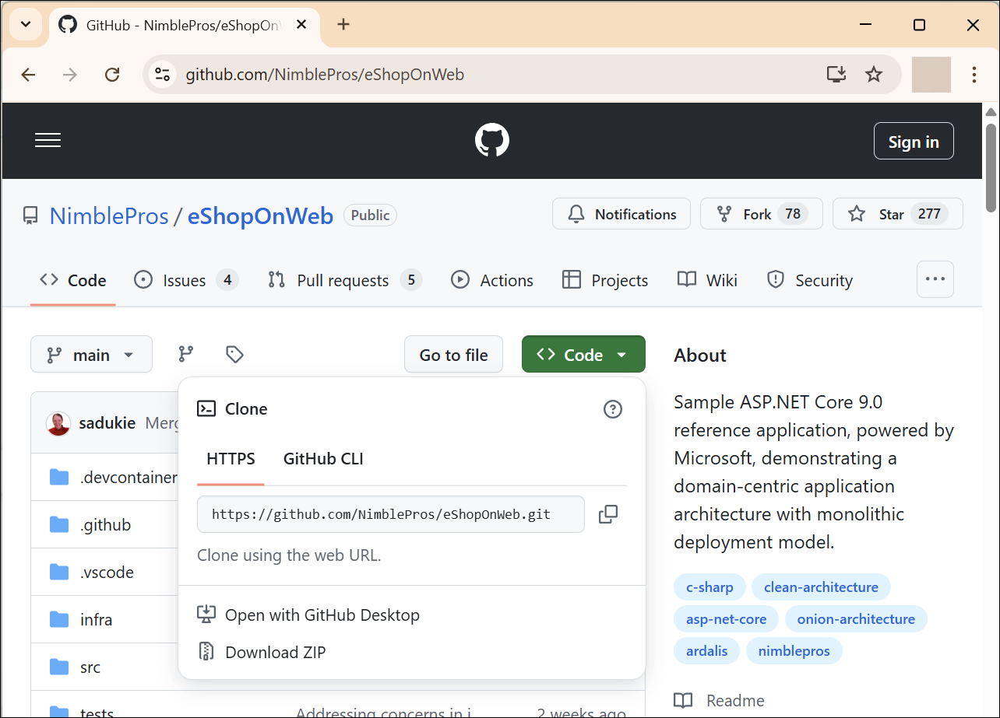
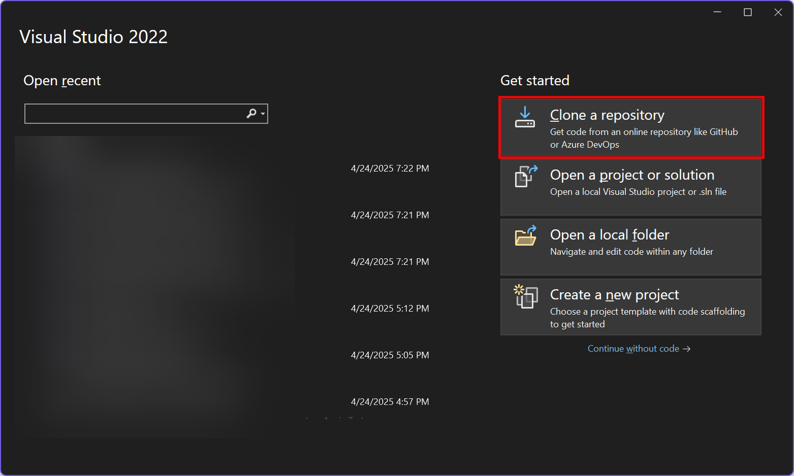
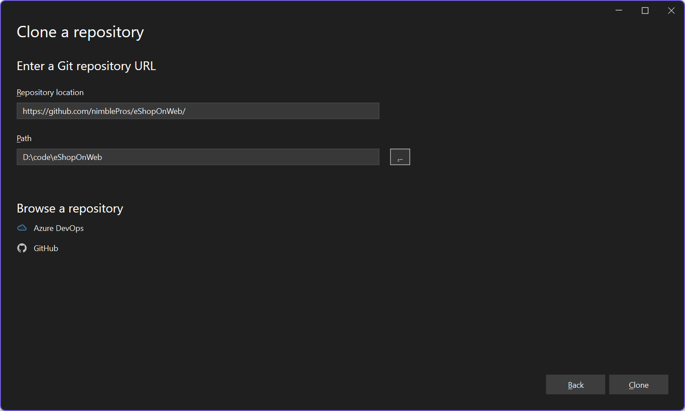

If you're new to building applications with ASP.NET Core and Visual Studio, go through [this ASP.NET Razor Pages tutorial](https://learn.microsoft.com/aspnet/core/data/ef-rp/intro?view=aspnetcore-9.0&tabs=visual-studio) or [this ASP.NET MVC tutorial](https://learn.microsoft.com/aspnet/core/data/ef-mvc/intro?view=aspnetcore-9.0) to help get you started. 

Once you've completed this tutorial, you're ready to learn how to build real world applications using ASP.NET Core and some related technologies, as demonstrated in this eShopOnWeb reference application. Be sure to [download and review the free 100+ page eBook](https://aka.ms/webappebook), which covers high-level concepts and principles for architecting applications. The rest of this guide will provide you with additional resources to make sure you're able to quickly start understand this sample.

## Getting the Code

You can access [the eShopOnWeb sample code](https://github.com/NimblePros/eShopOnWeb) on your machine by either downloading it as a ZIP file or cloning it using Git. In either case, click on the **Code** button, then get the URL for cloning Clone download the ZIP file:



You can download the ZIP file and then open the SLN file in Visual Studio 2022.

Otherwise, from Visual Studio 2022, you can choose **Clone a repository** or check out code from the launch screen:



and then put in https://github.com/NimblePros/eShopOnWeb as the URL to clone.



Once you have a copy of the code, open the **eShopOnWeb.sln** solution file. Then right-click on the **Web** project and select **Set as Startup Project**. Now you're ready to run the application.

## Solution Structure

As applications grow in size, it can be worthwhile to break them up into several projects, usually based on their focus. This follows the [Separation of Concerns principle](https://deviq.com/principles/separation-of-concerns), and common examples of focus for individual portions of an application are user interface (UI), business logic, and data access or infrastructure. The eShopOnWeb solution has been split up into three main application projects:

- BlazorAdmin
- PublicApi
- Web

There are 2 additional supporting projects:

- ApplicationCore
- Infrastructure

The business logic and domain model are kept in the ApplicationCore project. Data access and other infrastructure plumbing code belongs in the Infrastructure project. And ASP.NET Core (Web) concerns belong in the Web project. The solution also has a number of different kinds of automated tests, found in separate Test folders. Projects depend on one another and can help enforce the direction of dependencies. In this case, we don't want our business logic to depend on low level plumbing code like that found in the Infrastructure project, so we structure the dependency direction so that Infrastructure depends on Application Core. This follows the [Dependency Inversion Principle (DIP)](https://deviq.com/dependency-inversion-principle/), because the implementation code in Infrastructure implements interfaces defined in ApplicationCore. ([Learn more about SOLID Principles for C# Developers](https://mailchi.mp/nimblepros/solid-email-course))

## ApplicationCore Project

The ApplicationCore project holds the business logic for the application. This business logic is contained in a domain model - a set of classes that represent concepts in the business domain being automated. In this case, the domain model represents online store concepts like Buyers, Orders, and Baskets. These entities have state that is stored in a data store using EF Core, but the use of EF Core is an implementation detail that is kept out of the ApplicationCore project. Groups of related entities, like a basket and its items, are grouped together as [aggregates](https://deviq.com/aggregate-pattern/), which are retrieved and saved from persistence as a unit.

This project also holds the business-level interface abstractions used by the application and mostly implemented in the Infrastructure project. These include interfaces for performing data access (repositories) as well as various services that perform logging or send emails or define database queries (specifications). Some of these interfaces are implemented within the ApplicationCore project, as long as they don't have any dependencies on specific implementation details that would require the ApplicationCore project to take on such a dependency.

The project also holds custom exceptions, like the BasketNotFoundException, and domain services like the BasketService and OrderService which perform business logic but don't directly work with infrastructure like databases or files.

Finally, the project's specifications are used to define different kinds of queries in a testable and reusable fashion. Each specification type defines all of the logic required to run a query using a repository.

## Infrastructure Project

The Infrastructure project holds the implementation details for how the application works with infrastructure concerns. Things like databases, email providers, and file systems. Low level plumbing code. Knowledge of these concerns in a separate project so they can't pollute the business/domain model that's kept in ApplicationCore, which in turns makes it much easier to write unit tests of the most valuable logic in the system, the business logic. Code that has dependencies on infrastructure can often still be tested, but usually only with integration tests, not unit tests. See [Unit Test or Integration Test and Why You Should Care](https://ardalis.com/unit-test-or-integration-test-and-why-you-should-care) to learn more about this distinction.

The infrastructure concerns implemented in this project include:

- Data Access using EF Core (see `CatalogContext`)
- [Identity](https://docs.microsoft.com/en-us/aspnet/core/security/authentication/identity?view=aspnetcore-2.2&tabs=visual-studio) (also using EF Core) (see `AppIdentityDbContext`)
- Logging (`LoggerAdapter`)
- Email Sending (`EmailSender`)

## Web Project

The Web project has several features you're already familiar with from the [video tutorials](https://docs.microsoft.com/en-us/visualstudio/get-started/csharp/tutorial-aspnet-core-ef-step-01?view=vs-2022), but there are a few additions as well that are described here.

[Areas in ASP.NET Core](https://docs.microsoft.com/en-us/aspnet/core/mvc/controllers/areas?view=aspnetcore-2.2) are used to organize functionality, and in this case the Identity functionality uses an Area for configuration and customization.

[Extensions](https://docs.microsoft.com/en-us/dotnet/csharp/programming-guide/classes-and-structs/extension-methods) are helper methods that can add methods to existing objects. The `Extensions` folder has two classes that contain extension methods for email sending and url generation.

[Health checks](https://docs.microsoft.com/en-us/aspnet/core/host-and-deploy/health-checks?view=aspnetcore-2.2) are an ASP.NET Core feature that is used to visualize the status of a web application so users (and IT staff) can determine whether the application is healthy.

This application also supports running the application in a docker container, which is configured by the `Dockerfile` in the root of the Web project folder. [Learn more about hosting ASP.NET Core applications in Docker containers](https://docs.microsoft.com/en-us/aspnet/core/host-and-deploy/docker/?view=aspnetcore-2.2).

## Test Projects

This solution includes several projects that include automated tests. These tests confirm that the code in the application projects works as expected. You can [learn more about testing ASP.NET Core apps here](https://docs.microsoft.com/en-us/dotnet/core/testing/unit-testing-with-dotnet-test).

## Dependency Injection

ASP.NET Core and this application make heavy use of a technique called [dependency injection](https://docs.microsoft.com/en-us/aspnet/core/fundamentals/dependency-injection). Classes that have dependencies declare them in their constructor, following the [Explicit Dependencies Principle](https://deviq.com/explicit-dependencies-principle/). Typically, these dependencies in Web and ApplicationCore classes will be abstractions/interfaces, but sometimes implementation types are required, too (especially in Infrastructure types). Determining how the requested interfaces will map to implementation classes is handled in the `ConfigureServices` method in the Web project's `Startup.cs` file's `ConfigureServices` method.

## Identity and Authorization

As noted above, the Web application has authorization configured for the app using [Identity](https://docs.microsoft.com/en-us/aspnet/core/security/authentication/identity). This is configured with its own EF Core database context (`AppIdentityDbContext`) and when you run the app you work with identity when you register or log in. It's generally a good idea to avoid tightly coupling your authorization process with your business logic, so you'll notice that ApplicationCore has no knowledge of the app's auth strategy.

The BlazorAdmin application uses a [custom AuthenticationStateProvider](https://learn.microsoft.com/en-us/aspnet/core/blazor/security/authentication-state?view=aspnetcore-9.0&pivots=server#implement-a-custom-authenticationstateprovider) for its authorization.

The PublicApi application makes use of [JWT bearer tokens](https://learn.microsoft.com/en-us/aspnet/core/security/authentication/configure-jwt-bearer-authentication?view=aspnetcore-9.0). This uses the same identity database context configuration that the Web application uses.

There are three demo accounts to work with:

| Account Name | Password | Role |
|--------------|----------|------|
| demouser@microsoft.com | Pass@word1 | |
| productmgr@microsoft.com | Pass@word1 | Product Manager |
| admin@microsoft.com | Pass@word1 | Administrator |

If you want to get into the code with a friendly guide, check out this course from [NimblePros Academy](https://academy.nimblepros.com) on [ASP.NET Identity in Action: Implementing Individual Accounts](https://academy.nimblepros.com/purchase?product_id=6215750). Note: This URL will give you a discounted price on the course, not the full price.

## Performance Considerations

One final consideration this sample includes that many basic examples leave out is caching, which is used to optimize the site's performance and minimize inefficient calls to external data. The site's home page uses data in the form of a `CatalogIndexViewModel` which the Razor Page binds to in order to display data on the page. This view model is created by the `CatalogViewModelService` which in turn uses several repository types to get data from the site's configured data store and convert it into the structure the `CatalogIndexViewModel` requires. This data doesn't change often, so requesting it from the database on every request to the page is inefficient and put unnecessary load on the database server while increasing page render times for users.

A common technique to address this scenario is the add caching, so that results from getting data from the data store are stored on the web server for some period of time and reused by future web requests. In this application, the caching is done by the `CachedCatalogViewModelService` which acts as a decorator or wrapper around the `CatalogViewModelService`. You can see how it is configured for use by the application in `Startup.cs`:

```csharp
  services.AddScoped<ICatalogViewModelService, CachedCatalogViewModelService>();
```

If you wanted to disable caching for the application, you would replace this line with this one that uses the `CatalogViewModelService` directly:

```csharp
  services.AddScoped<ICatalogViewModelService, CatalogViewModelService>();
```

## Get Help

If you need help with the sample, you can [open an issue](https://github.com/NimblePros/eShopOnWeb/issues). Describe the problem you're having and the steps you've taken so far to try to resolve it, and someone in the community or from Microsoft will try to help you. If your question or problem isn't specific to this sample, you may find it better to ask it on [Stackoverflow.com](https://stackoverflow.com/).