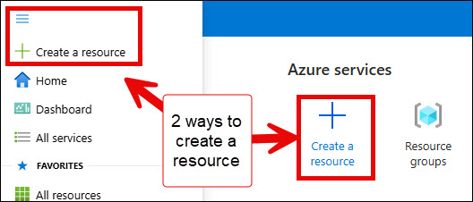
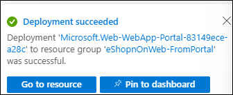
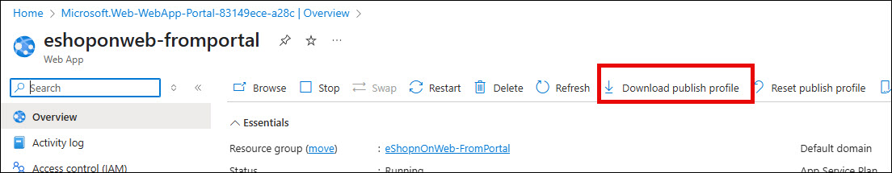
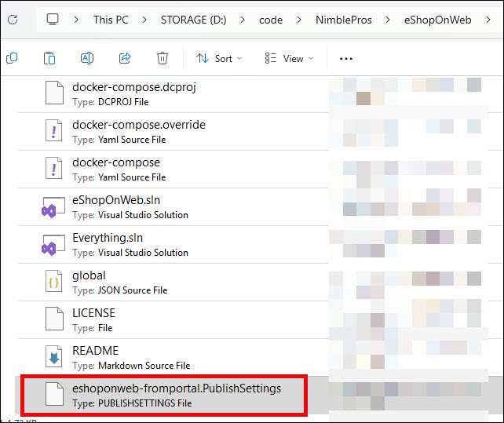
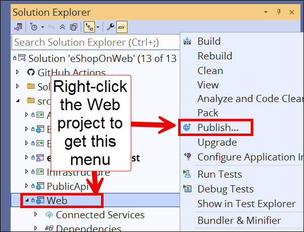
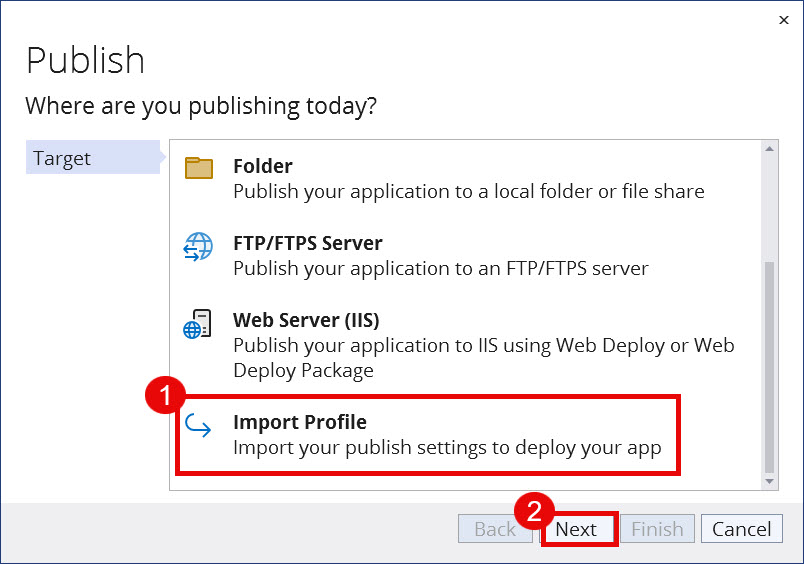
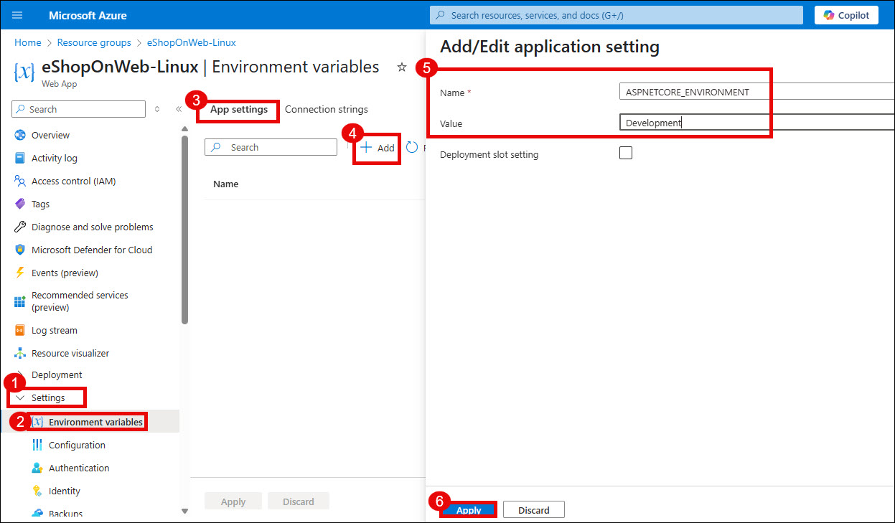
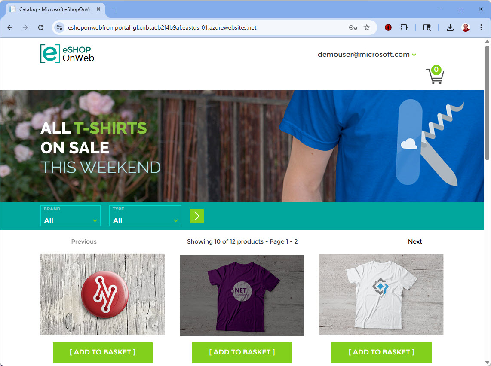

_**Last updated**: June 13, 2025_

Sometimes, you may need to deploy using Web Deploy - such as if the Kudu site is down or if your company prefers Web Deploy. This demo will walk you through deploying via Web Deploy.

To deploy the eShopOnWeb sample to an Azure App Service, starting in the Azure Portal, follow these step-by-step instructions (or, [deploy to Azure directly from from Visual Studio]({{ site.baseurl }}/walkthroughs/deploy-to-azure-app-service-from-visual-studio)):

## Create and Configure the Azure Web App

1. Clone or download the eShopOnWeb sample to a folder on your local machine.

1. Log in to the [Azure Portal](https://portal.azure.com/) with your Microsoft Account.

1. Select the "+ Create resource" either for the portal home page or under the hamburger menu (&equiv;).

    

1. Select `Web App`.

   

1. On the **Create Web App** screen, in the **Project Details** section, choose a subscription. Then choose a new resource group name or select an existing one, then select **Review + create**. 

    For the **Instance Details**, enter a name for the web app. Select Publish as **Code**. Select `.NET 9` for the **Runtime stack**. Then, select `Windows` for the **Operating System**. Select an appropriate Region.

    In **Pricing plans**, select an appropriate pricing plan.

    Then, select **Review + Create**. Then, select **Create**.

In a few moments you should see that the deployment was successful.

## Download Publish Profile

1. Once the deployment succeeds, go to the new web app.

1. Select `Download publish profile`.

   

    > **Note**: This may complain that you cannot download the file because basic authentication is disabled. Under **Settings** > **Configuration** > **General Settings**, you may need to turn `On` for both **SCM Basic Auth Publishing Credentials** and **FTP Basic Auth Publishing Credentials**. If you change these settings, then Restart the web app before trying to download the publish profile. [Learn more about disabling Basic Authentication.](https://learn.microsoft.com/azure/app-service/configure-basic-auth-disable?tabs=portal)

1. Copy the downloaded `.PublishSettings` file to the `eShopOnWeb/src/Web` folder.

   

1. Open the `eShopOnWeb.sln` solution file.

1. Right-click on the `Web` project and select `Publish`. 

    

1. Select `+ New profile`. In the **Publish** dialog, on the **Target** step, select `Import Profile`. Select **Next**.

    

1. Select the `.PublishSettings` file you saved in the `eShopOnWeb/src/Web` folder. 

1. Make sure the `fromportal` publish profile is selected. Then, Click `Publish`. 

    You should see files being copied. When the publish process completes, the site should open in your browser.

## Update Azure App Settings' Environment Variables

In order to populate the seed data, we need to set the `ASPNETCORE_ENVIRONMENT` variable to `Development`. (Note: This is not the same as `Debug` vs. `Release` configuration). The sample data is only seeded in the `Development` environment. **This is only needed if you are working in development.** You can configure the App Service to run in `Development` as follows:

1. In the Azure Portal, navigate to your Web App.

1. Select **Settings** > **Environment Variables**.

1. In the **App settings** section, add a new key `ASPNETCORE_ENVIRONMENT` with value `Development`.

1. Select **Apply**.

1. Add another key for `UseOnlyInMemoryDatabase` with the value of `true`.

1. Select **Apply**.

    

1. Finally, select **Apply** to apply all of these changes to the App Service.

At this point, you should be able to refresh the site and see it loaded with data (if not, publish once more from Visual Studio).

[Learn more about Azure deployment options in the official documentation](https://docs.microsoft.com/en-us/azure/app-service-web/web-sites-deploy).